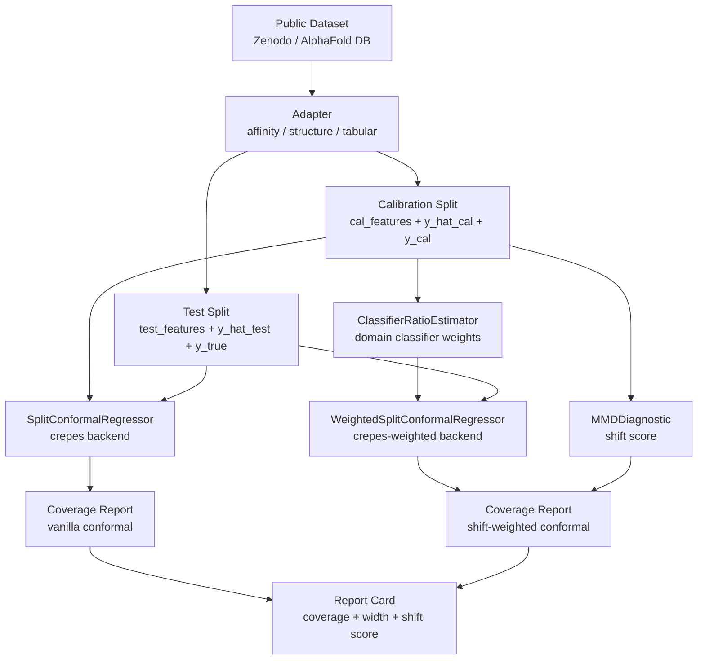

<!-- SPDX-License-Identifier: MIT -->
# driftset

**Reproducible, GPU-free conformal coverage harness for scientific foundation models under distribution shift.**

`driftset` answers one practical question: *when a scientific foundation model (e.g. Boltz-2 binding affinity, AlphaFold pLDDT) reports a confidence score, how often is the ground truth actually inside the prediction interval — and what happens to that coverage when the test distribution drifts from the calibration distribution?*

It uses split conformal prediction and covariate-shift–weighted conformal prediction over **public, precomputed predictions** (no GPU, no model re-inference required), then prints a **coverage report card**: target vs. empirical coverage, the naive-vs-calibrated gap, mean interval width, and a shift score.

> [!IMPORTANT]
> **Scope, honestly.** driftset does **not** introduce a new shift-correction method. The conformal machinery is provided by the BSD-3 libraries [`crepes`](https://github.com/henrikbostrom/crepes) and [`crepes-weighted`](https://github.com/predict-idlab/crepes-weighted); driftset contributes the adapter protocol, the scientific-FM bindings, the reproducible public-data pipeline, and the measured coverage report card.
> Weighted conformal prediction corrects **covariate** shift (a change in the input distribution) only; it does **not** correct **concept** shift (a change in the predictor's error behaviour, e.g. confidently-wrong fold-switchers). driftset flags the latter via a shift score but cannot repair it.

---

## Architecture



---

## Why this exists

Confidence scores from scientific foundation models are widely used as decision gates, yet they are known to be miscalibrated and to degrade under distribution shift. Prior work (e.g. CalPro, arXiv:2601.07201) studies shift-robust conformal coverage for protein structure but ships no public code. driftset is the engineering complement: a small, installable, public-data package that *measures* coverage and makes the measurement reproducible.

## Install

```bash
pip install driftset        # once published
# or, from a clone:
uv sync --extra dev
```

## Quickstart

```python
from driftset.adapters.affinity import boltz2_affinity_adapter
from driftset.datasets import zenodo_affinity
from driftset.decision.report import compute_coverage_report

frame = zenodo_affinity.load()              # downloads + caches public Data S6 (CC-BY-4.0)
adapter = boltz2_affinity_adapter()
cal, test = frame.iloc[: len(frame) // 2], frame.iloc[len(frame) // 2 :]
report = compute_coverage_report(adapter, cal, test, confidence=0.90)
print(report.empirical_coverage, report.mean_interval_width)
```

## How it works

1. **Adapter** — each scientific FM has a thin adapter (`src/driftset/adapters/`) that extracts model predictions and features from a standardized dataframe. Current adapters: Boltz-2 affinity, AlphaFold pLDDT (structure), and a generic tabular baseline.

2. **Split conformal** (`src/driftset/conformal/split.py`) — fits a conformal regressor on the calibration half, then computes prediction intervals on the test half. No GPU, no re-inference; only the precomputed predictions are needed.

3. **Shift detection** (`src/driftset/shift/detector.py`) — a domain classifier separates calibration from test points; its output probability gives importance weights `w(x) = [p/(1-p)] * (n_cal/n_test)` (MMD is also computed as a scalar diagnostic).

4. **Weighted conformal** (`src/driftset/conformal/weighted.py`) — reweights calibration scores with the importance weights before computing intervals, restoring marginal coverage under covariate shift.

5. **Report card** (`src/driftset/decision/report.py`) — aggregates target coverage, empirical coverage, interval width, and shift score into a structured summary. Decision API (`src/driftset/decision/api.py`) translates intervals into abstain/call decisions against a threshold.

## Coverage report card — Boltz-2 binding affinity

Measured on the public ChEMBL-derived Boltz-2 benchmark (random iid split, n_cal = n_test = 4609). Every number is reproduced by `scripts/run_affinity_coverage.py` and committed to [`reports/affinity_coverage.json`](reports/affinity_coverage.json) / [`reports/PROVENANCE.md`](reports/PROVENANCE.md).

| Target coverage | Conformal (calibrated) | Naive Gaussian | Conformal width (pAffinity) |
|---|---|---|---|
| 0.80 | 0.7928 | 0.7958 | 2.997 |
| 0.90 | 0.9028 | 0.8974 | 3.940 |
| 0.95 | 0.9525 | 0.9419 | 4.927 |

Reading it honestly: distribution-free conformal lands on the nominal target at every level; the Gaussian-assumption baseline is close but under-covers in the upper tail (0.942 vs the 0.95 target), because the affinity residuals are slightly heavier-tailed than Gaussian. The gap here is modest — the larger payoff appears under distribution shift.

## Coverage report card — under covariate shift

We induce a covariate shift by biasing the test set toward **low-confidence** Boltz-2 compounds (which carry larger errors), detected as a shift score (squared MMD) of 0.080. Vanilla split conformal then under-covers; covariate-shift weighting with domain-classifier importance weights restores coverage toward the target. Reproduced by `scripts/run_shift_coverage.py` → [`reports/shift_coverage.json`](reports/shift_coverage.json) (n_cal = 4836, n_test = 4382, effective n ≈ 675).

| Target | Vanilla (shifted) | Weighted | Vanilla width | Weighted width |
|---|---|---|---|---|
| 0.80 | 0.7825 | 0.8122 | 2.97 | 3.16 |
| 0.90 | 0.8834 | 0.9151 | 3.83 | 4.21 |
| 0.95 | 0.9329 | 0.9642 | 4.64 | 5.26 |

Honesty notes: weighting trades calibration bias for variance, so with skewed estimated weights a small fraction of intervals (~1%) hit maximum size; widths above are medians over finite intervals and ~99% are finite. The recovery is real but bounded by how well the domain classifier estimates the density ratio — driftset measures this rather than assuming it.

## Datasets

| Adapter | Source | License | Ground truth |
|---|---|---|---|
| Boltz-2 affinity | ChEMBL-derived Boltz-2 benchmark, Zenodo DOI [10.5281/zenodo.18669539](https://doi.org/10.5281/zenodo.18669539) | CC-BY-4.0 | experimental pChEMBL |
| AlphaFold pLDDT *(code only — measured card deferred to v0.1.1)* | AlphaFold DB pLDDT + CASP/CAMEO lDDT | CC-BY-4.0 | experimental lDDT |

**What is measured in v0.1:** the Boltz-2 affinity adapter (both tables above), end-to-end from public data. The AlphaFold pLDDT adapter ships as **code on the same protocol** with a synthetic test, but its *measured* coverage card is **deferred to v0.1.1**: no turnkey pre-paired pLDDT/lDDT table is publicly distributed, so shipping a measured pLDDT number now would mean fabricating or hand-rolling data. Calibration datasets are downloaded on demand and are **not** vendored into the repository.

## Decisions from intervals

A calibrated interval becomes a risk-aware decision against a threshold (e.g. an activity cutoff): items whose whole interval sits on one side are called; items whose interval straddles the threshold **abstain**.

```python
from driftset.decision.api import evaluate_threshold_decisions

# intervals: (n, 2) from a fitted regressor; y_true: held-out labels
summary = evaluate_threshold_decisions(intervals, y_true, threshold=7.0)
print(summary["abstain_rate"], summary["decision_error"])
```

Because the interval carries the coverage guarantee, the error among *decided* items is controlled at the chosen confidence; the abstention rate is the cost.

## Status

Pre-alpha (`v0.1.0a1`). Measured: Boltz-2 affinity coverage (iid + induced shift). Deferred to v0.1.1: measured AlphaFold pLDDT coverage; the online/ACI conformal variant. Known limitation: weighted CP corrects covariate shift only and can inflate a small fraction of intervals when estimated weights are skewed (reported via the finite fraction, never hidden).

## License

[MIT](LICENSE). Calibration **data** retains its own upstream license (CC-BY-4.0 / CC-BY-SA where noted); those licenses bind the data, not this code.
